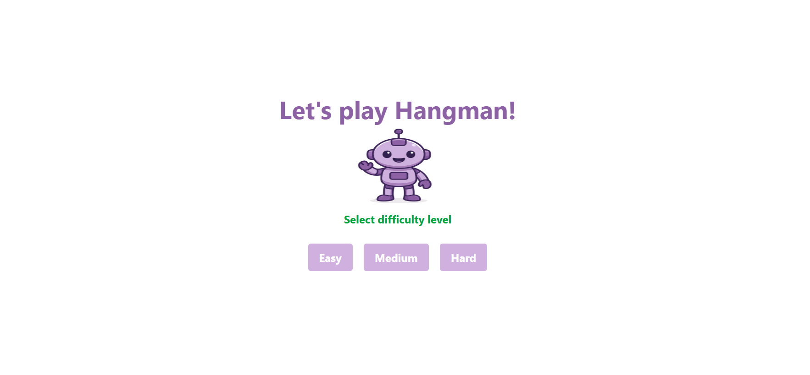
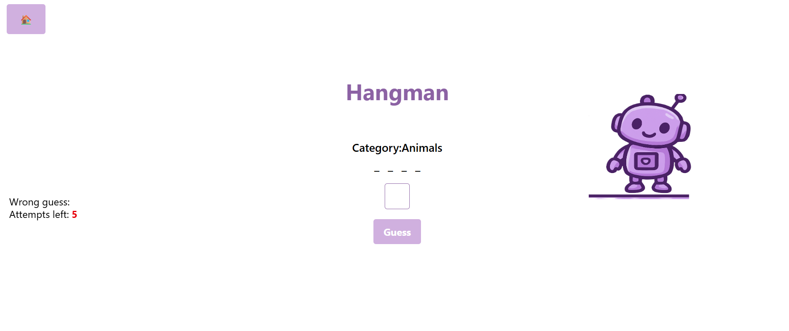

# Hangman





A fun hangman game made with React, Vite, TailwindCSS, and Framer Motion.
You guess letters to find the hidden word before you run out of tries. 
The game has animations to make it more fun.


**Features:**
- Guess one letter at a time
- Hangman picture changes when you guess wrong
- Win animation when you find the word
- Shake effect on hangman picture when you guess wrong
- Shows the category of the word
- Buttons to play again or go back home
- Clean design with TailwindCSS
- Smooth animations with Framer Motion

**Technologies:**
- React
- Vite
- Tailwind CSS
- Framer Motion

## How to play hangman

Follow the steps:

- **Node.js**: A JavaScript runtime that is required to run the app. [Download Node.js](https://nodejs.org/)
- Clone the repository
   ```bash
   git clone https://github.com/PrinDyane/hangman
- Access repository-name
    ```bash
   cd hangman
- Install dependencies 
    ```bash
   npm install 
- Run app 
    ```bash
    npm run dev   
Made with 💜 by Dyane Albuquerque 
